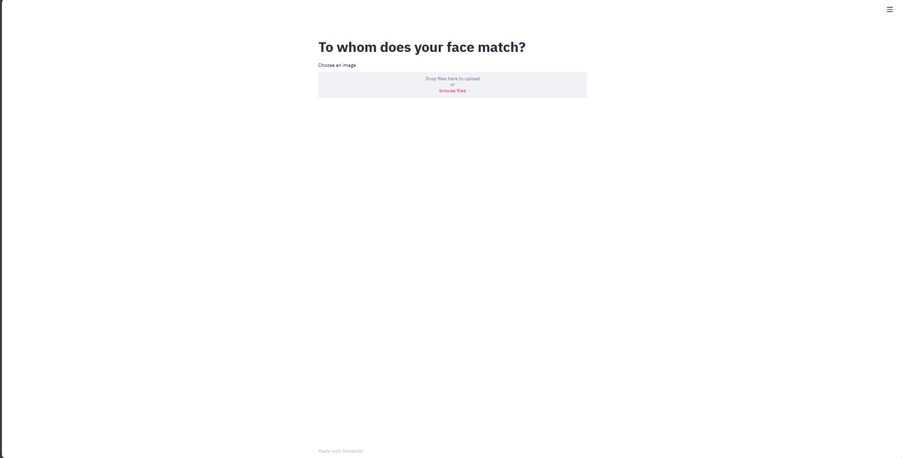
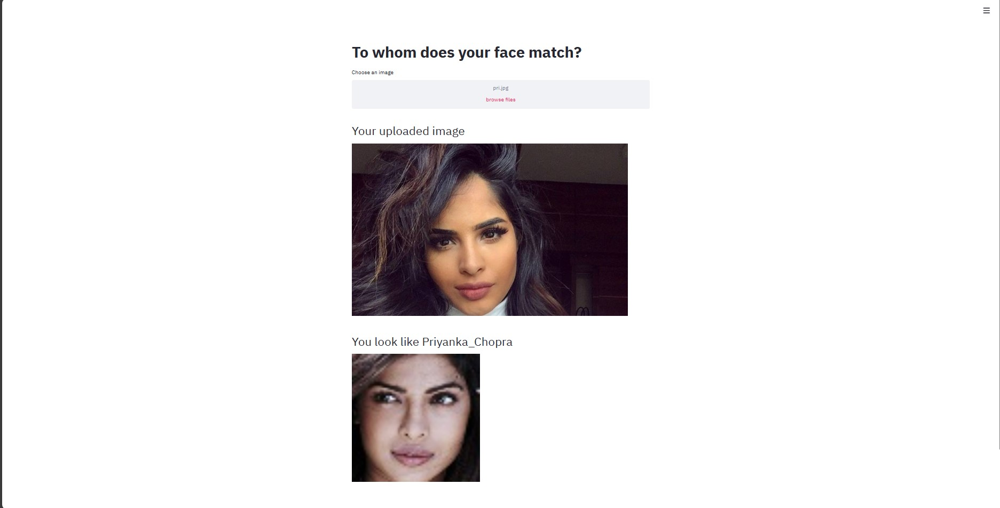
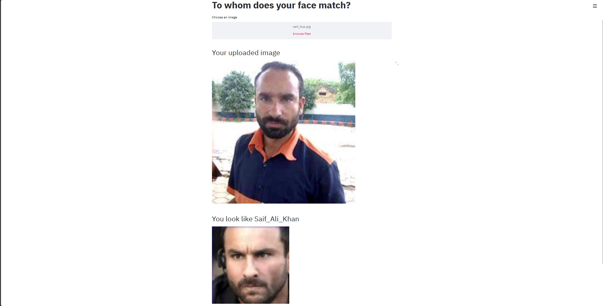
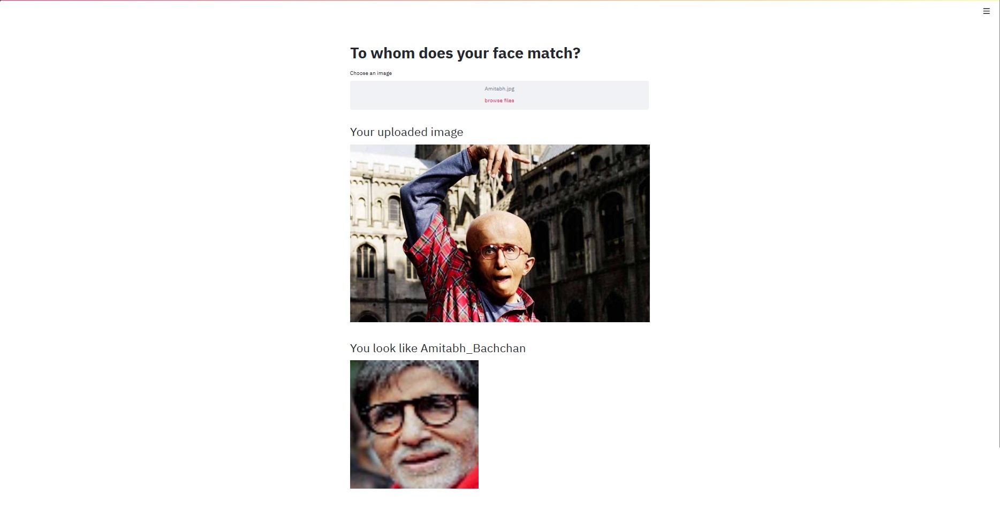
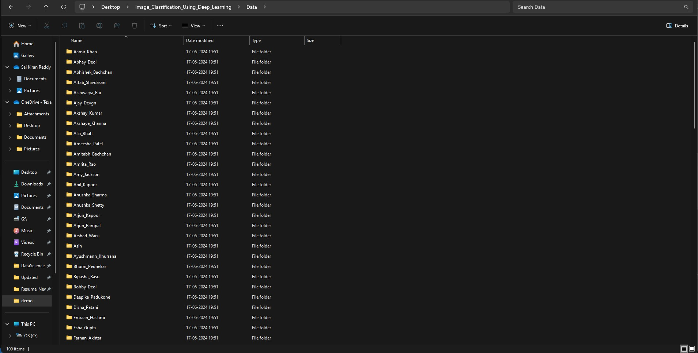

# Indian-Celebrity-Look-Alike-Predictor-Using-VGGFace

A Deep learning based streamlit web app which can tell with which Indian bollywood celebrity your face resembles.

Face recognition is the problem of identifying and verifying people in a photograph by their face.
It is a task that is trivially performed by humans, even under varying light and when faces are changed by age or obstructed with accessories and facial hair. Nevertheless, it is remained a challenging computer vision problem for decades until recently.

Deep learning methods are able to leverage very large datasets of faces and learn rich and compact representations of faces, allowing modern models to first perform as-well and later to outperform the face recognition capabilities of humans.

In this project, you will discover the problem of face recognition and how deep learning methods can achieve superhuman performance to identify similar faces.

This is a methods of identifying similar faces check various aspects on pictures, including: face shape, nose, eyes and mouth; face position in the picture; skin color (including the lighting of the photo); color and hair and cosine_similarity.

# Dataset has been used:
https://www.kaggle.com/sushilyadav1998/bollywood-celeb-localized-face-dataset


# Some Real Time Demo:

Web app look



Lets check some of images





This really performing good you can consider by seeing this result 😀




## Commands to Setup Project on Local Machine

1. **Clone the repository:**
   ```bash
   git clone https://github.com/dyavadi8769/Indian-Celebrity-Look-Alike-Predictor-Using-VGGFace
   cd ipl-innings-score-predictor

2.  **Create a virtual environment and activate it:**
    ```bash
    conda create -p env python==3.7 -y
    conda activate env/ 

3.  **Install the Required Dependecies:**
    ```bash
    pip install -r requirements.txt

4.  **Download the data and make sure all the actors folders are in one folder:**

    
    
5.  **Run the following command if you are not changing the data:**
    ```bash
    python run.py

5. **Run the Web App:**
    ```bash
    streamlit run app.py


yes!! Now you can start predicting 🙂

# Author:

```bash
Author: Sai Kiran Reddy Dyavadi
Role  : Data Scientist
Email : dyavadi324@gmail.com
```

